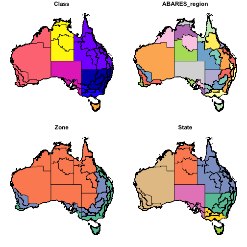
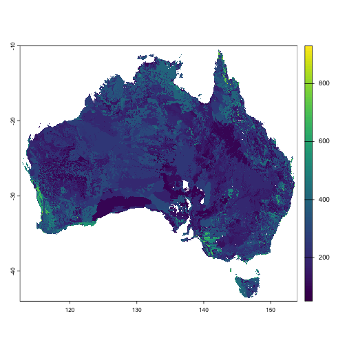

This vignette demonstrates some of the functionality of {read.abares} and how to work with some of the spatial and tabular data available through {read.abares}.
Please note that not all functions are demonstrated here, please refer to the [documentation reference](https://adamhsparks.github.io/read.abares/reference/) for a full list of functionality.
The worked examples here show some of the more advanced features that {read.abares} offers beyond just fetching and importing data, _e.g._, Australian Agricultural and Grazing Industries Survey (AAGIS) spatial shapefile which can be used with tabular data from the historical estimates, the Australian Gridded Farm Data, which can be downloaded, cached and then imported using one of four types of object or the soil thickness data, which includes rich metadata.

First we need to load the {read.abares} library.


``` r
library(read.abares)
```

## Working with AAGIS Regions Spatial Data

### Obtaining the AAGIS Regions Spatial Data

ABARES offers spatial data for the Australian Agricultural and Grazing Industries Survey (AAGIS) regions that can be used for mapping tabular data from the estimates, _e.g._, `read_historical_regional_estimates()` or `read_state_estimates()`.


``` r
aagis_regions <- read_aagis_regions(cache = TRUE)

plot(aagis_regions)
```

<div class="figure" style="text-align: center">

<p class="caption">AAGIS regions shapefile</p>
</div>

### Obtaining AAGIS Data by Region

{read.abares} offers functions to download the ABARES estimates based on the AAGIS results for national level, `read_historical_national_estimates()`, regional level `read_historical_regional_estimates()`, and state level `read_historical_state_estimates()` and also by performance category `read_estimates_by_performance_category()` and size category `read_estimates_by_size()`.
For this example, we will use the `read_historical_regional_estimates()` function to download the AAGIS data for the regions in the AAGIS regions shapefile and join the data and visualise some of the data.


``` r
aagis_region_data <- read_historical_regional_estimates()
```

Filter the AAGIS region data to represent the total area cropped for the year of 2023.
This will make the next few examples execute much more quickly.


``` r
library(dplyr)
#> 
#> Attaching package: 'dplyr'
#> The following object is masked from 'package:testthat':
#> 
#>     matches
#> The following objects are masked from 'package:stats':
#> 
#>     filter, lag
#> The following objects are masked from 'package:base':
#> 
#>     intersect, setdiff, setequal, union

aagis_region_data <- filter(aagis_region_data,
                            Variable == "Total area cropped (ha)",
                            Year == 2023)
```

### Merging the AAGIS Regions Spatial Data with the AAGIS Regional Data

Using `read_aagis_regions()` and `read_historical_regional_estimates()`, we can merge the two datasets together to visualise the data.
To join the data, we will use the `left_join()` function from the {dplyr} package.


``` r
aagis_dat <- left_join(aagis_regions, aagis_region_data)
#> Joining with `by = join_by(ABARES_region)`
```

Once we've joined the data, we can visualise it using {ggplot2}.
Here we can plot the total area cropped (ha) and facet by year for all of Australia for the year 2023.


``` r
library(ggplot2)

ggplot(total_area) +
  geom_sf(aes(fill = Value), colour = NA) +
  scale_fill_viridis_c() +
  labs(

    fill = "Total Area Cropped (ha)"
  ) +
  facet_wrap(~Year) +
  theme_minimal()
#> Error: object 'total_area' not found
```

## Working With AGFD Data

You can download files and pipe directly into the class object that you desire for the Australian Farm Gridded Data (AGFD) data.

### Description of the Australian Farm Gridded Data

Directly from the DAFF website:

>The Australian Gridded Farm Data are a set of national scale maps containing simulated data on historical broadacre farm business outcomes including farm profitability on an 0.05-degree (approximately 5 km) grid.

>These data have been produced by read.abares as part of the ongoing Australian Agricultural Drought Indicator (AADI) project (previously known as the Drought Early Warning System Project) and were derived using read.abares farmpredict model, which in turn is based on read.abares Agricultural and Grazing Industries Survey (AAGIS) data.

>These maps provide estimates of farm business profit, revenue, costs and production by location (grid cell) and year for the period 1990-91 to 2022-23. The data do not include actual observed outcomes but rather model predicted outcomes for representative or ‘typical' broadacre farm businesses at each location considering likely farm characteristics and prevailing weather conditions and commodity prices.

>The Australian Gridded Farm Data remain under active development, and as such should be considered experimental.

-- Australian Department of Agriculture, Fisheries and Forestry.


Load the {read.abares} library.


``` r
library(read.abares)
```

Check the file format information for the NetCDF files.


``` r
print_agfd_nc_file_format()
#> ────────────────────────────────────────────────────────────────────────────────
#> Each of the layers in simulation output data is represented as a 2D raster in
#> NETCDF files, with the following grid format:
#> CRS: EPSG:4326 - WGS 84 - Geographic
#> Extent: 111.975 -44.525 156.275 -9.975
#> Unit: Degrees
#> Width: 886
#> Height: 691
#> Cell size: 0.05 degree x 0.05 degree
#> ────────────────────────────────────────────────────────────────────────────────
#> For further details, see the ABARES website,
#> <https://www.agriculture.gov.au/abares/research-topics/surveys/farm-survey-data/australian-gridded-farm-data>
```

Download or load from the local cache and read the AGFD files as a list of {stars} objects.


``` r
# A list of {stars} objects for the climate in year 2000
star <- get_agfd(cache = TRUE, yr = 2000) |>
  read_agfd_stars()
#> Will return stars object with 612226 cells.
#> No projection information found in nc file. 
#>  Coordinate variable units found to be degrees, 
#>  assuming WGS84 Lat/Lon.

head(star[[1]])
#> stars object with 2 dimensions and 6 attributes
#> attribute(s):
#>                         Min.         1st Qu.         Median           Mean
#> farmno          15612.000000 233091.50000000 329567.0000000 324737.7187618
#> R_total_hat_ha      3.105843      7.09662085     19.7569846    169.1918352
#> C_total_hat_ha      1.282748      4.27412711      9.8605795     94.1287971
#> FBP_fci_hat_ha   -134.049904      2.86625943      9.8397018     75.0630380
#> FBP_fbp_hat_ha   -328.818624      3.42896902     12.3912337     63.5968722
#> A_wheat_hat_ha      0.000000      0.04116083      0.1126724      0.1368933
#>                        3rd Qu.           Max.   NA's
#> farmno          418508.5000000 669706.0000000 443899
#> R_total_hat_ha     161.2597086   2459.0029014 443899
#> C_total_hat_ha      92.5196069   1908.2287127 443899
#> FBP_fci_hat_ha      66.9675602   1224.9113170 443899
#> FBP_fbp_hat_ha      59.2320889   1214.8330655 443899
#> A_wheat_hat_ha       0.2099372      0.5107011 565224
#> dimension(s):
#>     from  to         refsys              values x/y
#> lon    1 886 WGS 84 (CRS84) [886] 112,...,156.2 [x]
#> lat    1 691 WGS 84 (CRS84) [691] -44.5,...,-10 [y]
```

Download or load from the local cache and read the AGFD files as a [terra::rast](https://rspatial.github.io/terra/reference/rast.html) object.


``` r
# A {terra} `rast` object
terr <- get_agfd(cache = TRUE, yr = 2000) |>
  read_agfd_terra()

head(terr[[1]])
#> class       : SpatRaster 
#> dimensions  : 6, 886, 41  (nrow, ncol, nlyr)
#> resolution  : 0.05, 0.05  (x, y)
#> extent      : 111.975, 156.275, -10.275, -9.975  (xmin, xmax, ymin, ymax)
#> coord. ref. : lon/lat WGS 84 (CRS84) (OGC:CRS84) 
#> source(s)   : memory
#> names       : farmno, R_tot~at_ha, C_tot~at_ha, FBP_f~at_ha, FBP_f~at_ha, A_whe~at_ha, ... 
#> min values  :    NaN,         NaN,         NaN,         NaN,         NaN,         NaN, ... 
#> max values  :    NaN,         NaN,         NaN,         NaN,         NaN,         NaN, ...
```

Download or load from the local cache and read the AGFD files as a list of {tidync} objects.


``` r
# A list of {tidync} objects
tdnc <- get_agfd(cache = TRUE, yr = 2000) |>
  read_agfd_tidync()

head(tdnc[[1]])
#> $source
#> # A tibble: 1 × 2
#>   access              source                                                    
#>   <dttm>              <chr>                                                     
#> 1 2025-05-07 13:46:43 /Users/283204f/Library/Caches/org.R-project.R/R/read.abar…
#> 
#> $axis
#> # A tibble: 84 × 3
#>     axis variable       dimension
#>    <int> <chr>              <int>
#>  1     1 lon                    0
#>  2     2 lat                    1
#>  3     3 farmno                 0
#>  4     4 farmno                 1
#>  5     5 R_total_hat_ha         0
#>  6     6 R_total_hat_ha         1
#>  7     7 C_total_hat_ha         0
#>  8     8 C_total_hat_ha         1
#>  9     9 FBP_fci_hat_ha         0
#> 10    10 FBP_fci_hat_ha         1
#> # ℹ 74 more rows
#> 
#> $grid
#> # A tibble: 3 × 4
#>   grid  ndims variables         nvars
#>   <chr> <int> <list>            <int>
#> 1 D0,D1     2 <tibble [41 × 1]>    41
#> 2 D0        1 <tibble [1 × 1]>      1
#> 3 D1        1 <tibble [1 × 1]>      1
#> 
#> $dimension
#> # A tibble: 2 × 8
#>      id name  length unlim coord_dim active start count
#>   <int> <chr>  <dbl> <lgl> <lgl>     <lgl>  <int> <int>
#> 1     0 lon      886 FALSE TRUE      TRUE       1   886
#> 2     1 lat      691 FALSE TRUE      TRUE       1   691
#> 
#> $variable
#> # A tibble: 43 × 7
#>       id name            type      ndims natts dim_coord active
#>    <int> <chr>           <chr>     <int> <int> <lgl>     <lgl> 
#>  1     0 lon             NC_DOUBLE     1     2 TRUE      FALSE 
#>  2     1 lat             NC_DOUBLE     1     2 TRUE      FALSE 
#>  3     2 farmno          NC_DOUBLE     2     1 FALSE     TRUE  
#>  4     3 R_total_hat_ha  NC_DOUBLE     2     1 FALSE     TRUE  
#>  5     4 C_total_hat_ha  NC_DOUBLE     2     1 FALSE     TRUE  
#>  6     5 FBP_fci_hat_ha  NC_DOUBLE     2     1 FALSE     TRUE  
#>  7     6 FBP_fbp_hat_ha  NC_DOUBLE     2     1 FALSE     TRUE  
#>  8     7 A_wheat_hat_ha  NC_DOUBLE     2     1 FALSE     TRUE  
#>  9     8 H_wheat_dot_hat NC_DOUBLE     2     1 FALSE     TRUE  
#> 10     9 A_barley_hat_ha NC_DOUBLE     2     1 FALSE     TRUE  
#> # ℹ 33 more rows
#> 
#> $attribute
#> # A tibble: 49 × 4
#>       id name       variable       value       
#>    <int> <chr>      <chr>          <named list>
#>  1     0 _FillValue lon            <dbl [1]>   
#>  2     1 units      lon            <chr [1]>   
#>  3     0 _FillValue lat            <dbl [1]>   
#>  4     1 units      lat            <chr [1]>   
#>  5     0 _FillValue farmno         <dbl [1]>   
#>  6     0 _FillValue R_total_hat_ha <dbl [1]>   
#>  7     0 _FillValue C_total_hat_ha <dbl [1]>   
#>  8     0 _FillValue FBP_fci_hat_ha <dbl [1]>   
#>  9     0 _FillValue FBP_fbp_hat_ha <dbl [1]>   
#> 10     0 _FillValue A_wheat_hat_ha <dbl [1]>   
#> # ℹ 39 more rows
```

Download or load from the local cache and read the AGFD files as a {data.table} object.


``` r

# A {data.table} object
dtbl <- get_agfd(cache = TRUE, yr = 2000) |>
  read_agfd_dt()

#Check the completeness and other metadata about the data 
library(skimr)
#> 
#> Attaching package: 'skimr'
#> The following object is masked from 'package:testthat':
#> 
#>     matches
skim(dtbl)
```


Table: Data summary

|                         |       |
|:------------------------|:------|
|Name                     |dtbl   |
|Number of rows           |168327 |
|Number of columns        |44     |
|Key                      |NULL   |
|_______________________  |       |
|Column type frequency:   |       |
|character                |1      |
|numeric                  |43     |
|________________________ |       |
|Group variables          |None   |


**Variable type: character**

|skim_variable | n_missing| complete_rate| min| max| empty| n_unique| whitespace|
|:-------------|---------:|-------------:|---:|---:|-----:|--------:|----------:|
|id            |         0|             1|  26|  26|     0|        1|          0|


**Variable type: numeric**

|skim_variable         | n_missing| complete_rate|      mean|        sd|       p0|       p25|       p50|       p75|      p100|hist  |
|:---------------------|---------:|-------------:|---------:|---------:|--------:|---------:|---------:|---------:|---------:|:-----|
|farmno                |         0|          1.00| 324737.72| 119413.06| 15612.00| 233091.50| 329567.00| 418508.50| 669706.00|▂▆▇▆▁ |
|R_total_hat_ha        |         0|          1.00|    169.19|    303.84|     3.11|      7.10|     19.76|    161.26|   2459.00|▇▁▁▁▁ |
|C_total_hat_ha        |         0|          1.00|     94.13|    169.85|     1.28|      4.27|      9.86|     92.52|   1908.23|▇▁▁▁▁ |
|FBP_fci_hat_ha        |         0|          1.00|     75.06|    139.61|  -134.05|      2.87|      9.84|     66.97|   1224.91|▇▁▁▁▁ |
|FBP_fbp_hat_ha        |         0|          1.00|     63.60|    113.65|  -328.82|      3.43|     12.39|     59.23|   1214.83|▁▇▁▁▁ |
|A_wheat_hat_ha        |    121325|          0.28|      0.14|      0.12|     0.00|      0.04|      0.11|      0.21|      0.51|▇▅▂▂▁ |
|H_wheat_dot_hat       |    129784|          0.23|      2.46|      0.92|     0.42|      1.69|      2.44|      3.12|      5.43|▃▇▇▃▁ |
|A_barley_hat_ha       |    121325|          0.28|      0.06|      0.06|     0.00|      0.00|      0.05|      0.09|      0.29|▇▃▂▁▁ |
|H_barley_dot_hat      |    134701|          0.20|      2.41|      0.75|     0.03|      1.91|      2.43|      2.92|      4.98|▁▅▇▃▁ |
|A_sorghum_hat_ha      |    152991|          0.09|      0.02|      0.04|     0.00|      0.00|      0.00|      0.00|      0.25|▇▁▁▁▁ |
|H_sorghum_dot_hat     |    165558|          0.02|      3.47|      0.99|     1.39|      2.67|      3.32|      4.24|      6.51|▃▇▅▃▁ |
|A_oilseeds_hat_ha     |    121325|          0.28|      0.05|      0.05|     0.00|      0.00|      0.02|      0.09|      0.30|▇▃▂▁▁ |
|H_oilseeds_dot_hat    |    144457|          0.14|      1.64|      0.47|     0.32|      1.34|      1.66|      1.98|      3.02|▂▅▇▅▁ |
|R_wheat_hat_ha        |    121325|          0.28|    122.86|    124.40|     0.00|     19.52|     79.59|    201.29|    894.12|▇▃▁▁▁ |
|R_sorghum_hat_ha      |    152991|          0.09|     13.24|     35.84|     0.00|      0.04|      0.23|      1.66|    375.66|▇▁▁▁▁ |
|R_oilseeds_hat_ha     |    121325|          0.28|     51.46|     66.99|     0.00|      0.00|      9.76|     95.01|    619.06|▇▁▁▁▁ |
|R_barley_hat_ha       |    121325|          0.28|     44.12|     56.62|     0.00|      0.29|     21.32|     63.49|    309.55|▇▂▁▁▁ |
|Q_wheat_hat_ha        |    121325|          0.28|      0.33|      0.34|     0.00|      0.05|      0.21|      0.53|      2.26|▇▃▁▁▁ |
|Q_barley_hat_ha       |    121325|          0.28|      0.12|      0.16|     0.00|      0.00|      0.06|      0.18|      0.89|▇▂▁▁▁ |
|Q_sorghum_hat_ha      |    152991|          0.09|      0.05|      0.13|     0.00|      0.00|      0.00|      0.00|      1.50|▇▁▁▁▁ |
|Q_oilseeds_hat_ha     |    121325|          0.28|      0.08|      0.10|     0.00|      0.00|      0.02|      0.15|      0.76|▇▂▁▁▁ |
|S_wheat_cl_hat_ha     |    121325|          0.28|      0.05|      0.05|     0.00|      0.01|      0.03|      0.07|      0.43|▇▂▁▁▁ |
|S_sheep_cl_hat_ha     |         0|          1.00|      0.20|      0.52|     0.00|      0.00|      0.00|      0.09|      5.07|▇▁▁▁▁ |
|S_sheep_births_hat_ha |         0|          1.00|      0.14|      0.36|     0.00|      0.00|      0.00|      0.06|      3.90|▇▁▁▁▁ |
|S_sheep_deaths_hat_ha |         0|          1.00|      0.01|      0.03|     0.00|      0.00|      0.00|      0.01|      0.34|▇▁▁▁▁ |
|S_beef_cl_hat_ha      |         0|          1.00|      0.07|      0.14|     0.00|      0.01|      0.02|      0.06|      1.87|▇▁▁▁▁ |
|S_beef_births_hat_ha  |         0|          1.00|      0.03|      0.06|     0.00|      0.00|      0.01|      0.02|      0.75|▇▁▁▁▁ |
|S_beef_deaths_hat_ha  |         0|          1.00|      0.00|      0.00|     0.00|      0.00|      0.00|      0.00|      0.04|▇▁▁▁▁ |
|Q_beef_hat_ha         |         0|          1.00|      0.02|      0.05|     0.00|      0.00|      0.01|      0.02|      0.70|▇▁▁▁▁ |
|Q_sheep_hat_ha        |         0|          1.00|      0.08|      0.20|     0.00|      0.00|      0.00|      0.03|      2.47|▇▁▁▁▁ |
|Q_lamb_hat_ha         |         0|          1.00|      0.09|      0.25|     0.00|      0.00|      0.00|      0.03|      3.27|▇▁▁▁▁ |
|R_beef_hat_ha         |         0|          1.00|     50.65|    129.53|     0.00|      3.99|     12.45|     31.13|   1785.92|▇▁▁▁▁ |
|R_sheep_hat_ha        |         0|          1.00|     14.20|     35.77|     0.00|      0.03|      0.26|      5.82|    442.53|▇▁▁▁▁ |
|R_lamb_hat_ha         |         0|          1.00|     18.30|     50.75|     0.00|      0.00|      0.15|      5.33|    645.74|▇▁▁▁▁ |
|C_fodder_hat_ha       |         0|          1.00|      4.51|     10.33|     0.06|      0.22|      0.74|      3.73|    197.98|▇▁▁▁▁ |
|C_fert_hat_ha         |         0|          1.00|     16.65|     35.99|     0.00|      0.01|      0.05|      8.92|    367.57|▇▁▁▁▁ |
|C_fuel_hat_ha         |         0|          1.00|      5.64|      9.81|     0.12|      0.35|      0.66|      6.04|    110.46|▇▁▁▁▁ |
|C_chem_hat_ha         |         0|          1.00|      9.27|     21.28|     0.00|      0.00|      0.02|      4.71|    195.40|▇▁▁▁▁ |
|A_total_cropped_ha    |         0|          1.00|      0.07|      0.16|     0.00|      0.00|      0.00|      0.03|      0.82|▇▁▁▁▁ |
|FBP_pfe_hat_ha        |         0|          1.00|     70.04|    123.69|  -291.84|      3.65|     12.94|     67.12|   1314.10|▇▃▁▁▁ |
|farmland_per_cell     |         0|          1.00|   2060.59|    616.84|    61.72|   1752.29|   2188.27|   2463.95|   3024.09|▁▁▃▇▅ |
|lon                   |         0|          1.00|    136.82|     10.76|   113.15|    130.55|    139.95|    145.05|    153.60|▃▂▃▇▅ |
|lat                   |         0|          1.00|    -26.21|      5.97|   -43.45|    -30.90|    -26.45|    -21.65|    -10.75|▁▆▇▆▂ |


## Working With the Soil Thickness Map

You can download the soil depth map and import it as a {stars} or [terra::rast()](https://rspatial.github.io/terra/reference/rast.html) object.


``` r
library(read.abares)
get_topsoil_thickness(cache = TRUE) |>
  read_topsoil_thickness_stars()
#> stars object with 2 dimensions and 1 attribute
#> attribute(s), summary of first 100000 cells:
#>             Min. 1st Qu. Median Mean 3rd Qu. Max.   NA's
#> thpk_1.tif    NA      NA     NA  NaN      NA   NA 100000
#> dimension(s):
#>   from   to offset delta refsys point x/y
#> x    1 4150  112.5  0.01 WGS 84 FALSE [x]
#> y    1 3401 -9.995 -0.01 WGS 84 FALSE [y]

x <- get_topsoil_thickness(cache = TRUE) |>
  read_topsoil_thickness_terra()
```

For your convenience, {read.abares} re-exports [terra::plot()](https://rspatial.github.io/terra/reference/plot.html), so you can just use `plot()` with the {terra} objects in {read.abares}.


``` r
plot(x)
```

<div class="figure" style="text-align: center">

<p class="caption">Soil Thickness for Australian areas of intensive agriculture of Layer 1 (A Horizon - top-soil) (derived from soil mapping)</p>
</div>

### Soil Thickness Metadata

By default, a brief bit of metadata is printed to the console when you call the topsoil thickness object in your R session.


``` r
library(read.abares)
get_topsoil_thickness(cache = TRUE)
#> 
#> ── Soil Thickness for Australian areas of intensive agriculture of Layer 1 (A Ho
#> 
#> ── Dataset ANZLIC ID ANZCW1202000149 ──
#> 
#> Feature attribute definition Predicted average Thickness (mm) of soil layer 1
#> in the 0.01 X 0.01 degree quadrat.
#> 
#> Custodian: CSIRO Land & Water
#> 
#> Jurisdiction Australia
#> 
#> Short Description The digital map data is provided in geographical coordinates
#> based on the World Geodetic System 1984 (WGS84) datum. This raster data set has
#> a grid resolution of 0.001 degrees (approximately equivalent to 1.1 km).
#> 
#> The data set is a product of the National Land and Water Resources Audit
#> (NLWRA) as a base dataset.
#> 
#> Data Type: Spatial representation type RASTER
#> 
#> Projection Map: projection GEOGRAPHIC
#> 
#> Datum: WGS84
#> 
#> Map Units: DECIMAL DEGREES
#> 
#> Scale: Scale/ resolution 1:1 000 000
#> 
#> Usage Purpose Estimates of soil depths are needed to calculate the amount of
#> any soil constituent in either volume or mass terms (bulk density is also
#> needed) - for example, the volume of water stored in the rooting zone
#> potentially available for plant use, to assess total stores of soil carbon for
#> greenhouse inventory or to assess total stores of nutrients.
#> 
#> Provide indications of probable thickness soil layer 1 in agricultural areas
#> where soil thickness testing has not been carried out.
#> 
#> Use Limitation: This dataset is bound by the requirements set down by the
#> National Land & Water Resources Audit
#> To see the full metadata, call `print_topsoil_thickness_metadata()` on a soil
#> thickness object in your R session.
```

But, {read.abares} provides a function for you to browse the topsoil thickness metadata in your console.


``` r
library(read.abares)
get_topsoil_thickness(cache = TRUE) |>
  print_topsoil_thickness_metadata()
#> 
#> ── Topsoil Thickness for Australian areas of intensive agriculture of Layer 1 (A
#> 
#> ── Dataset ANZLIC ID ANZCW1202000149 ──
#> 
#> Custodian CSIRO, Land & Water
#> 
#> Jurisdiction Australia
#> 
#> Description Abstract Surface of predicted Thickness of soil layer 1 (A Horizon
#> - top-soil) surface for the intensive agricultural areas of Australia.  Data
#> modelled from area based observations made by soil agencies both State and
#> CSIRO and presented as .0.01 degree grid cells.
#> 
#> Topsoils (A horizons) are defined as the surface soil layers in which organic
#> matter accumulates, and may include dominantly organic surface layers (O and P
#> horizons).
#> 
#> The depth of topsoil is important because, with their higher organic matter
#> contents, topsoils (A horizon) generally have more suitable properties for
#> agriculture, including higher permeability and higher levels of soil nutrients.
#> 
#> Estimates of soil depths are needed to calculate the amount of any soil
#> constituent in either volume or mass terms (bulk density is also needed) - for
#> example, the volume of water stored in the rooting zone potentially available
#> for plant use, to assess total stores of soil carbon for Greenhouse inventory
#> or to assess total stores of nutrients.
#> 
#> The pattern of soil depth is strongly related to topography - the shape and
#> slope of the land.  Deeper soils are typically found in the river valleys where
#> soils accumulate on floodplains and at the footslopes of ranges (zones of
#> deposition), while soils on hillslopes (zones of erosion) tend to be shallow.
#> Map of thickness of topsoil was derived from soil map data and interpreted
#> tables of soil properties for specific soil groups.
#> 
#> The quality of data on soil depth in existing soil profile datasets is
#> questionable and as the thickness of soil horizons varies locally with
#> topography, values for map units are general averages.
#> 
#> The final ASRIS polygon attributed surfaces are a mosaic of all of the data
#> obtained from various state and federal agencies. The surfaces have been
#> constructed with the best available soil survey information available at the
#> time. The surfaces also rely on a number of assumptions. One being that an area
#> weighted mean is a good estimate of the soil attributes for that polygon or
#> map-unit. Another assumption made is that the look-up tables provided by
#> McKenzie et al. (2000), state and territories accurately depict the soil
#> attribute values for each soil type.
#> 
#> The accuracy of the maps is most dependent on the scale of the original polygon
#> data sets and the level of soil survey that has taken place in each state.  The
#> scale of the various soil maps used in deriving this map is available by
#> accessing the data-source grid, the scale is used as an assessment of the
#> likely accuracy of the modelling.  The Atlas of Australian Soils is considered
#> to be the least accurate dataset and has therefore only been used where there
#> is no state based data.  Of the state datasets Western Australian sub-systems,
#> South Australian land systems and NSW soil landscapes and reconnaissance
#> mapping would be the most reliable based on scale. NSW soil landscapes and
#> reconnaissance mapping use only one dominant soil type per polygon in the
#> estimation of attributes.  South Australia and Western Australia use several
#> soil types per polygon or map-unit.
#> 
#> The digital map data is provided in geographical coordinates based on the World
#> Geodetic System 1984 (WGS84) datum. This raster data set has a grid resolution
#> of 0.001 degrees (approximately equivalent to 1.1 km).
#> 
#> The data set is a product of the National Land and Water Resources Audit
#> (NLWRA) as a base dataset.
#> 
#> Search Word(s) AGRICULTURE SOIL Physics Models
#> 
#> Geographic Extent Name(s) GEN Category
#> 
#> GEN Custodial Jurisdiction
#> 
#> GEN Name
#> 
#> Geographic Bounding Box North Bounding Latitude -10.707149 South Bounding
#> Latitude -43.516831 East Bounding Longitude 113.19673 West Bounding Longitude
#> 153.990779
#> 
#> Geographic Extent Polygon(s) 115.0 -33.5,115.7 -33.3,115.7 -31.7,113.2
#> -26.2,113.5 -25.4,114.1 -26.4,114.3 -26.0,113.4 -24.3,114.1 -21.8,122.3
#> -18.2,122.2 -17.2,126.7 -13.6,129.1 -14.9,130.6 -12.3,132.6 -12.1,132.5
#> -11.6,131.9 -11.3,132.0 -11.1,137.0 -12.2,135.4 -14.7,140.0 -17.7,140.8
#> -17.4,141.7 -15.1,141.4 -13.7,142.2 -10.9,142.7 -10.7,143.9 -14.5,144.6
#> -14.1,145.3 -14.9,146.3 -18.8,148.9 -20.5,150.9 -22.6,153.2 -25.9,153.7
#> -28.8,153.0 -31.3,150.8 -34.8,150.0 -37.5,147.8 -37.9,146.3 -39.0,144.7
#> -38.4,143.5 -38.8,141.3 -38.4,139.7 -37.3,139.7 -36.9,139.9 -36.7,138.9
#> -35.5,138.1 -35.7,138.6 -34.7,138.1 -34.2,137.8 -35.1,136.9 -35.3,137.0
#> -34.9,137.5 -34.9,137.4 -34.0,137.9 -33.5,137.8 -32.6,137.3 -33.6,135.9
#> -34.7,136.1 -34.8,136.0 -35.0,135.1 -34.6,135.2 -34.5,135.4 -34.5,134.7
#> -33.3,134.0 -32.9,133.7 -32.1,133.3 -32.2,132.2 -32.0,131.3 -31.5,127.3
#> -32.3,126.0 -32.3,123.6 -33.9,123.2 -34.0,122.1 -34.0,121.9 -33.8,119.9
#> -34.0,119.6 -34.4,118.0 -35.1,116.0 -34.8,115.0 -34.3,115.0 -33.5
#> 
#> 147.8 -42.9,147.9 -42.6,148.2 -42.1,148.3 -42.3,148.3 -41.3,148.3 -41.0,148.0
#> -40.7,147.4 -41.0,146.7 -41.1,146.6 -41.2,146.5 -41.1,146.4 -41.2,145.3
#> -40.8,145.3 -40.7,145.2 -40.8,145.2 -40.8,145.2 -40.8,145.0 -40.8,144.7
#> -40.7,144.7 -41.2,145.2 -42.2,145.4 -42.2,145.5 -42.4,145.5 -42.5,145.2
#> -42.3,145.5 -43.0,146.0 -43.3,146.0 -43.6,146.9 -43.6,146.9 -43.5,147.1
#> -43.3,147.0 -43.1,147.2 -43.3,147.3 -42.8,147.4 -42.9,147.6 -42.8,147.5
#> -42.8,147.8 -42.9,147.9 -43.0,147.7 -43.0,147.8 -43.2,147.9 -43.2,147.9
#> -43.2,148.0 -43.2,148.0 -43.1,148.0 -42.9,147.8 -42.9
#> 
#> 136.7 -13.8,136.7 -13.7,136.6 -13.7,136.6 -13.8,136.4 -13.8,136.4 -14.1,136.3
#> -14.2,136.9 -14.3,137.0 -14.2,136.9 -14.2,136.7 -14.1,136.9 -13.8,136.7
#> -13.8,136.7 -13.8
#> 
#> 139.5 -16.6,139.7 -16.5,139.4 -16.5,139.2 -16.7,139.3 -16.7,139.5 -16.6
#> 
#> 153.0 -25.2,153.0 -25.7,153.1 -25.8,153.4 -25.0,153.2 -24.7,153.2 -25.0,153.0
#> -25.2
#> 
#> 137.5 -36.1,137.7 -35.9,138.1 -35.9,137.9 -35.7,137.6 -35.7,137.6 -35.6,136.6
#> -35.8,136.7 -36.1,137.2 -36.0,137.5 -36.1
#> 
#> 143.9 -39.7,144.0 -39.6,144.1 -39.8,143.9 -40.2,143.9 -40.0,143.9 -39.7
#> 
#> 148.0 -39.7,147.7 -39.9,147.9 -39.9,148.0 -40.1,148.1 -40.3,148.3 -40.2,148.3
#> -40.0,148.0 -39.7
#> 
#> 148.1 -40.4,148.0 -40.4,148.4 -40.3,148.4 -40.5,148.1 -40.4
#> 
#> 130.4 -11.3,130.4 -11.2,130.6 -11.3,130.7 -11.4,130.9 -11.3,131.0 -11.4,131.1
#> -11.3,131.2 -11.4,131.3 -11.2,131.5 -11.4,131.5 -11.5,131.0 -11.9,130.8
#> -11.8,130.6 -11.7,130.0 -11.8,130.1 -11.7,130.3 -11.7,130.1 -11.5,130.4 -11.3
#> 
#> Data Currency Beginning date 1999-09-01
#> 
#> Ending date 2001-03-31
#> 
#> Dataset Status Progress COMPLETE
#> 
#> Maintenance and Update Frequency NOT PLANNED
#> 
#> Access Stored Data Format DIGITAL - ESRI Arc/Info integer GRID
#> 
#> Available Format Type DIGITAL - ESRI Arc/Info integer GRID
#> 
#> Access Constraint Subject to the terms & condition of the data access &
#> management agreement between the National Land & Water Audit and ANZLIC parties
#> 
#> Data Quality Lineage The soil attribute surface was created using the following
#> datasets 1. The digital polygon coverage of the Soil-Landforms of the Murray
#> Darling Basis (MDBSIS)(Bui et al. 1998), classified as principal profile forms
#> (PPF's) (Northcote 1979). 2. The digital Atlas of Australian Soils (Northcote
#> et al.1960-1968)(Leahy, 1993). 3. Western Australia land systems coverage
#> (Agriculture WA). 4. Western Australia sub-systems coverage (Agriculture WA).
#> 5. Ord river catchment soils coverage (Agriculture WA). 6. Victoria soils
#> coverage (Victorian Department of Natural Resources and Environment - NRE). 7.
#> NSW Soil Landscapes and reconnaissance soil landscape mapping (NSW Department
#> of Land and Water Conservation - DLWC). 8. New South Wales Land systems west
#> (NSW Department of Land and Water Conservation - DLWC). 9. South Australia soil
#> land-systems (Primary Industries and Resources South Australia - PIRSA). 10.
#> Northern Territory soils coverage (Northern Territory Department of Lands,
#> Planning and Environment). 11. A mosaic of Queensland soils coverages
#> (Queensland Department of Natural Resources - QDNR). 12. A look-up table
#> linking PPF values from the Atlas of Australian Soils with interpreted soil
#> attributes (McKenzie et al. 2000). 13. Look_up tables provided by WA
#> Agriculture linking WA soil groups with interpreted soil attributes. 14.
#> Look_up tables provided by PIRSA linking SA soil groups with interpreted soil
#> attributes.
#> 
#> The continuous raster surface representing Thickness of soil layer 1 was
#> created by combining national and state level digitised land systems maps and
#> soil surveys linked to look-up tables listing soil type and corresponding
#> attribute values.
#> 
#> Because thickness is used sparingly in the Factual Key, estimations of
#> thickness in the look-up tables were made using empirical correlations for
#> particular soil types.
#> 
#> To estimate a soil attribute where more than one soil type was given for a
#> polygon or map-unit, the soil attribute values related to each soil type in the
#> look-up table were weighted according to the area occupied by that soil type
#> within the polygon or map-unit. The final soil attribute values are an area
#> weighted average for a polygon or map-unit.  The polygon data was then
#> converted to a continuous raster surface using the soil attribute values
#> calculated for each polygon.
#> 
#> The ASRIS soil attribute surfaces created using polygon attribution relied on a
#> number of data sets from various state agencies.  Each polygon data set was
#> turned into a continuous surface grid based on the calculated soil attribute
#> value for that polygon.  The grids where then merged on the basis that, where
#> available, state data replaced the Atlas of Australian Soils and MDBSIS.
#> MDBSIS derived soil attribute values were restricted to areas where MDBSIS was
#> deemed to be more accurate that the Atlas of Australian Soils (see Carlile et
#> al (2001a).
#> 
#> In cases where a soil type was missing from the look-up table or layer 2 did
#> not exist for that soil type, the percent area of the soils remaining were
#> adjusted prior to calculating the final soil attribute value. The method used
#> to attribute polygons was dependent on the data supplied by individual State
#> agencies.
#> 
#> The modelled grid was resampled from 0.0025 degree cells to 0.01 degree cells
#> using bilinear interpolation
#> 
#> Positional Accuracy The predictive surface is a 0.01 X 0.01 degree grid and has
#> a locational accurate of about 1m.
#> 
#> The positional accuracy of the defining polygons have variable positional
#> accuracy most locations are expected to be within 100m of the recorded
#> location.  The vertical accuracy is not relevant. The positional assessment has
#> been made by considering the tools used to generate the locational information
#> and contacting the data providers.
#> 
#> The other parameters used in the production of the led surface have a range of
#> positional accuracy ranging from + - 50 m to + - kilometres.  This contribute
#> to the loss of attribute accuracy in the surface.
#> 
#> Attribute Accuracy Input attribute accuracy for the areas is highly variable.
#> The predictive has a variable and much lower attribute accuracy due to the
#> irregular distribution and the limited positional accuracy of the parameters
#> used for modelling.
#> 
#> There are several sources of error in estimating soil depth and thickness of
#> horizons for the look-up tables.  Because thickness is used sparingly in the
#> Factual Key, estimations of thickness in the look-up tables were made using
#> empirical correlations for particular soil types.  The quality of data on soil
#> depth in existing soil profile datasets is questionable, in soil mapping,
#> thickness of soil horizons varies locally with topography, so values for map
#> units are general averages.  The definition of the depth of soil or regolith is
#> imprecise and it can be difficult to determine the lower limit of soil.
#> 
#> The assumption made that an area weighted mean of soil attribute values based
#> on soil type is a good estimation of a soil property is debatable, in that it
#> does not supply the soil attribute value at any given location. Rather it is
#> designed to show national and regional patterns in soil properties. The use of
#> the surfaces at farm or catchment scale modelling may prove inaccurate. Also
#> the use of look-up tables to attribute soil types is only as accurate as the
#> number of observations used to estimate a attribute value for a soil type. Some
#> soil types in the look-up tables may have few observations, yet the average
#> attribute value is still taken as the attribute value for that soil type.
#> Different states are using different taxonomic schemes making a national soil
#> database difficult. Another downfall of the area weighted approach is that some
#> soil types may not be listed in look-up tables. If a soil type is a dominant
#> one within a polygon or map-unit, but is not listed within the look-up table or
#> is not attributed within the look-up table then the final soil attribute value
#> for that polygon will be biased towards the minor soil types that do exist.
#> This may also happen when a large area is occupied by a soil type which has no
#> B horizon. In this case the final soil attribute value will be area weighted on
#> the soils with a B horizon, ignoring a major soil type within that polygon or
#> map-unit. The layer 2 surfaces have large areas of no-data because all soils
#> listed for a particular map-unit or polygon had no B horizon.
#> 
#> Logical Consistency Surface is fully logically consistent as only one parameter
#> is shown, as predicted average Soil Thickness within each grid cell
#> 
#> Completeness Surface is nearly complete.  There are some areas (about %1
#> missing) for which insufficient parameters were known to provide a useful
#> prediction and thus attributes are absent in these areas.
#> 
#> Contact Information Contact Organisation (s) CSIRO, Land & Water
#> 
#> Contact Position Project Leader
#> 
#> Mail Address ACLEP, GPO 1666
#> 
#> Locality Canberra
#> 
#> State ACT
#> 
#> Country AUSTRALIA
#> 
#> Postcode 2601
#> 
#> Telephone 02 6246 5922
#> 
#> Facsimile 02 6246 5965
#> 
#> Electronic Mail Address neil.mckenzie@cbr.clw.csiro.au
#> 
#> Metadata Date Metadata Date 2001-07-01
#> 
#> Additional Metadata Additional Metadata
#> 
#> Entity and Attributes Entity Name Soil Thickness Layer 1 (derived from mapping)
#> 
#> Entity description Estimated Soil Thickness (mm) of Layer 1 on a cell by cell
#> basis
#> 
#> Feature attribute name VALUE
#> 
#> Feature attribute definition Predicted average Thickness (mm) of soil layer 1
#> in the 0.01 X 0.01 degree quadrat
#> 
#> Data Type Spatial representation type RASTER
#> 
#> Projection Map projection GEOGRAPHIC
#> 
#> Datum WGS84
#> 
#> Map units DECIMAL DEGREES
#> 
#> Scale Scale/ resolution 1:1 000 000
#> 
#> Usage Purpose Estimates of soil depths are needed to calculate the amount of
#> any soil constituent in either volume or mass terms (bulk density is also
#> needed) - for example, the volume of water stored in the rooting zone
#> potentially available for plant use, to assess total stores of soil carbon for
#> Greenhouse inventory or to assess total stores of nutrients.
#> 
#> Provide indications of probable Thickness soil layer 1 in agricultural areas
#> where soil thickness testing has not been carried out
#> 
#> Use Use Limitation This dataset is bound by the requirements set down by the
#> National Land & Water Resources Audit
```

But you can also access it directly and use [pander::pander()] to include it in a document like this vignette.

<blockquote>

``` r
library(read.abares)
library(pander)
x <- get_topsoil_thickness(cache = TRUE)
y <- x$metadata
pander(y)
```

Dataset
ANZLIC ID
ANZCW1202000149

Title
Soil Thickness for Australian areas of intensive agriculture of Layer 1 (A Horizon - top-soil) (derived from soil mapping)

Custodian
CSIRO, Land & Water

Jurisdiction
Australia

Description
Abstract
Surface of predicted Thickness of soil layer 1 (A Horizon - top-soil) surface for the intensive agricultural areas of Australia.  Data modelled from area based observations made by soil agencies both State and CSIRO and presented as .0.01 degree grid cells.

Topsoils (A horizons) are defined as the surface soil layers in which organic matter accumulates, and may include dominantly organic surface layers (O and P horizons).

The depth of topsoil is important because, with their higher organic matter contents, topsoils (A horizon) generally have more suitable properties for agriculture, including higher permeability and higher levels of soil nutrients.

Estimates of soil depths are needed to calculate the amount of any soil constituent in either volume or mass terms (bulk density is also needed) - for example, the volume of water stored in the rooting zone potentially available for plant use, to assess total stores of soil carbon for Greenhouse inventory or to assess total stores of nutrients.

The pattern of soil depth is strongly related to topography - the shape and slope of the land.  Deeper soils are typically found in the river valleys where soils accumulate on floodplains and at the footslopes of ranges (zones of deposition), while soils on hillslopes (zones of erosion) tend to be shallow. 
Map of thickness of topsoil was derived from soil map data and interpreted tables of soil properties for specific soil groups.

The quality of data on soil depth in existing soil profile datasets is questionable and as the thickness of soil horizons varies locally with topography, values for map units are general averages.

The final ASRIS polygon attributed surfaces are a mosaic of all of the data obtained from various state and federal agencies. The surfaces have been constructed with the best available soil survey information available at the time. The surfaces also rely on a number of assumptions. One being that an area weighted mean is a good estimate of the soil attributes for that polygon or map-unit. Another assumption made is that the look-up tables provided by McKenzie et al. (2000), state and territories accurately depict the soil attribute values for each soil type.

The accuracy of the maps is most dependent on the scale of the original polygon data sets and the level of soil survey that has taken place in each state.  The scale of the various soil maps used in deriving this map is available by accessing the data-source grid, the scale is used as an assessment of the likely accuracy of the modelling.  The Atlas of Australian Soils is considered to be the least accurate dataset and has therefore only been used where there is no state based data.  Of the state datasets Western Australian sub-systems, South Australian land systems and NSW soil landscapes and reconnaissance mapping would be the most reliable based on scale. NSW soil landscapes and reconnaissance mapping use only one dominant soil type per polygon in the estimation of attributes.  South Australia and Western Australia use several soil types per polygon or map-unit.

The digital map data is provided in geographical coordinates based on the World Geodetic System 1984 (WGS84) datum. This raster data set has a grid resolution of 0.001 degrees  (approximately equivalent to 1.1 km).

The data set is a product of the National Land and Water Resources Audit (NLWRA) as a base dataset. 


Search Word(s)
AGRICULTURE  
SOIL Physics Models 

Geographic Extent Name(s)
GEN Category

GEN Custodial Jurisdiction

GEN Name

Geographic Bounding Box
North Bounding Latitude
-10.707149
South Bounding Latitude
-43.516831
East Bounding Longitude
113.19673
West Bounding Longitude
153.990779

Geographic Extent Polygon(s)
115.0 -33.5,115.7 -33.3,115.7 -31.7,113.2 -26.2,113.5 -25.4,114.1 -26.4,114.3 -26.0,113.4 -24.3,114.1 -21.8,122.3 -18.2,122.2 -17.2,126.7 -13.6,129.1 -14.9,130.6 -12.3,132.6 -12.1,132.5 -11.6,131.9 -11.3,132.0 -11.1,137.0 -12.2,135.4 -14.7,140.0 -17.7,140.8 -17.4,141.7 -15.1,141.4 -13.7,142.2 -10.9,142.7 -10.7,143.9 -14.5,144.6 -14.1,145.3 -14.9,146.3 -18.8,148.9 -20.5,150.9 -22.6,153.2 -25.9,153.7 -28.8,153.0 -31.3,150.8 -34.8,150.0 -37.5,147.8 -37.9,146.3 -39.0,144.7 -38.4,143.5 -38.8,141.3 -38.4,139.7 -37.3,139.7 -36.9,139.9 -36.7,138.9 -35.5,138.1 -35.7,138.6 -34.7,138.1 -34.2,137.8 -35.1,136.9 -35.3,137.0 -34.9,137.5 -34.9,137.4 -34.0,137.9 -33.5,137.8 -32.6,137.3 -33.6,135.9 -34.7,136.1 -34.8,136.0 -35.0,135.1 -34.6,135.2 -34.5,135.4 -34.5,134.7 -33.3,134.0 -32.9,133.7 -32.1,133.3 -32.2,132.2 -32.0,131.3 -31.5,127.3 -32.3,126.0 -32.3,123.6 -33.9,123.2 -34.0,122.1 -34.0,121.9 -33.8,119.9 -34.0,119.6 -34.4,118.0 -35.1,116.0 -34.8,115.0 -34.3,115.0 -33.5

147.8 -42.9,147.9 -42.6,148.2 -42.1,148.3 -42.3,148.3 -41.3,148.3 -41.0,148.0 -40.7,147.4 -41.0,146.7 -41.1,146.6 -41.2,146.5 -41.1,146.4 -41.2,145.3 -40.8,145.3 -40.7,145.2 -40.8,145.2 -40.8,145.2 -40.8,145.0 -40.8,144.7 -40.7,144.7 -41.2,145.2 -42.2,145.4 -42.2,145.5 -42.4,145.5 -42.5,145.2 -42.3,145.5 -43.0,146.0 -43.3,146.0 -43.6,146.9 -43.6,146.9 -43.5,147.1 -43.3,147.0 -43.1,147.2 -43.3,147.3 -42.8,147.4 -42.9,147.6 -42.8,147.5 -42.8,147.8 -42.9,147.9 -43.0,147.7 -43.0,147.8 -43.2,147.9 -43.2,147.9 -43.2,148.0 -43.2,148.0 -43.1,148.0 -42.9,147.8 -42.9

136.7 -13.8,136.7 -13.7,136.6 -13.7,136.6 -13.8,136.4 -13.8,136.4 -14.1,136.3 -14.2,136.9 -14.3,137.0 -14.2,136.9 -14.2,136.7 -14.1,136.9 -13.8,136.7 -13.8,136.7 -13.8

139.5 -16.6,139.7 -16.5,139.4 -16.5,139.2 -16.7,139.3 -16.7,139.5 -16.6

153.0 -25.2,153.0 -25.7,153.1 -25.8,153.4 -25.0,153.2 -24.7,153.2 -25.0,153.0 -25.2

137.5 -36.1,137.7 -35.9,138.1 -35.9,137.9 -35.7,137.6 -35.7,137.6 -35.6,136.6 -35.8,136.7 -36.1,137.2 -36.0,137.5 -36.1

143.9 -39.7,144.0 -39.6,144.1 -39.8,143.9 -40.2,143.9 -40.0,143.9 -39.7

148.0 -39.7,147.7 -39.9,147.9 -39.9,148.0 -40.1,148.1 -40.3,148.3 -40.2,148.3 -40.0,148.0 -39.7

148.1 -40.4,148.0 -40.4,148.4 -40.3,148.4 -40.5,148.1 -40.4

130.4 -11.3,130.4 -11.2,130.6 -11.3,130.7 -11.4,130.9 -11.3,131.0 -11.4,131.1 -11.3,131.2 -11.4,131.3 -11.2,131.5 -11.4,131.5 -11.5,131.0 -11.9,130.8 -11.8,130.6 -11.7,130.0 -11.8,130.1 -11.7,130.3 -11.7,130.1 -11.5,130.4 -11.3


Data Currency
Beginning date
1999-09-01

Ending date
2001-03-31

Dataset Status
Progress
COMPLETE

Maintenance and Update Frequency
NOT PLANNED

Access
Stored Data Format
DIGITAL - ESRI Arc/Info integer GRID

Available Format Type
DIGITAL - ESRI Arc/Info integer GRID

Access Constraint
Subject to the terms & condition of the data access & management agreement between the National Land & Water Audit and ANZLIC parties

Data Quality
Lineage
The soil attribute surface was created using the following datasets
1. The digital polygon coverage of the Soil-Landforms of the Murray Darling Basis (MDBSIS)(Bui et al. 1998), classified as principal profile forms (PPF's) (Northcote 1979).
2. The digital Atlas of Australian Soils (Northcote et al.1960-1968)(Leahy, 1993).
3. Western Australia land systems coverage (Agriculture WA).
4. Western Australia sub-systems coverage (Agriculture WA).
5. Ord river catchment soils coverage (Agriculture WA).
6. Victoria soils coverage (Victorian Department of Natural Resources and Environment - NRE).
7. NSW Soil Landscapes and reconnaissance soil landscape mapping (NSW Department of Land and Water Conservation
- DLWC).
8. New South Wales Land systems west (NSW Department of Land and Water Conservation - DLWC).
9. South Australia soil land-systems (Primary Industries and Resources South Australia - PIRSA).
10. Northern Territory soils coverage (Northern Territory Department of Lands, Planning and Environment).
11. A mosaic of Queensland soils coverages (Queensland Department of Natural Resources - QDNR).
12. A look-up table linking PPF values from the Atlas of Australian Soils with interpreted soil attributes (McKenzie et al. 2000).
13. Look_up tables provided by WA Agriculture linking WA soil groups with interpreted soil attributes.
14. Look_up tables provided by PIRSA linking SA soil groups with interpreted soil attributes.

The continuous raster surface representing Thickness of soil layer 1 was created by combining national and state level digitised land systems maps and soil surveys linked to look-up tables listing soil type and corresponding attribute values.

Because thickness is used sparingly in the Factual Key, estimations of thickness in the look-up tables were made using empirical correlations for particular soil types.

To estimate a soil attribute where more than one soil type was given for a polygon or map-unit, the soil attribute values related to each soil type in the look-up table were weighted according to the area occupied by that soil type within the polygon or map-unit. The final soil attribute values are an area weighted average for a polygon or map-unit.  The polygon data was then converted to a continuous raster surface using the soil attribute values calculated for each polygon.

The ASRIS soil attribute surfaces created using polygon attribution relied on a number of data sets from various state agencies.  Each polygon data set was turned into a continuous surface grid based on the calculated soil attribute value for that polygon.  The grids where then merged on the basis that, where available, state data replaced the Atlas of Australian Soils and MDBSIS.  MDBSIS derived soil attribute values were restricted to areas where MDBSIS was deemed to be more accurate that the Atlas of Australian Soils (see Carlile et al (2001a).

In cases where a soil type was missing from the look-up table or layer 2 did not exist for that soil type, the percent area of the soils remaining were adjusted prior to calculating the final soil attribute value. The method used to attribute polygons was dependent on the data supplied by individual State agencies.

The modelled grid was resampled from 0.0025 degree cells to 0.01 degree cells using bilinear interpolation

Positional Accuracy
The predictive surface is a 0.01 X 0.01 degree grid and has a locational accurate of about 1m.

The positional accuracy of the defining polygons have variable positional accuracy most locations are expected to be within 100m of the recorded location.  The vertical accuracy is not relevant. The positional assessment has been made by considering the tools used to generate the locational information and contacting the data providers.

 The other parameters used in the production of the led surface have a range of positional accuracy ranging from + - 50 m to + - kilometres.  This contribute to the loss of attribute accuracy in the surface.

Attribute Accuracy
Input attribute accuracy for the areas is highly variable.  The predictive has a variable and much lower attribute accuracy due to the irregular distribution and the limited positional accuracy of the parameters used for modelling.

There are several sources of error in estimating soil depth and thickness of horizons for the look-up tables.  Because thickness is used sparingly in the Factual Key, estimations of thickness in the look-up tables were made using empirical correlations for particular soil types.  The quality of data on soil depth in existing soil profile datasets is questionable, in soil mapping, thickness of soil horizons varies locally with topography, so values for map units are general averages.  The definition of the depth of soil or regolith is imprecise and it can be difficult to determine the lower limit of soil.

The assumption made that an area weighted mean of soil attribute values based on soil type is a good estimation of a soil property is debatable, in that it does not supply the soil attribute value at any given location. Rather it is designed to show national and regional patterns in soil properties. The use of the surfaces at farm or catchment scale modelling may prove inaccurate. Also the use of look-up tables to attribute soil types is only as accurate as the number of observations used to estimate a attribute value for a soil type. Some soil types in the look-up tables may have few observations, yet the average attribute value is still taken as the attribute value for that soil type. Different states are using different taxonomic schemes making a national soil database difficult.
Another downfall of the area weighted approach is that some soil types may not be listed in look-up tables. If a soil type is a dominant one within a polygon or map-unit, but is not listed within the look-up table or is not attributed within the look-up table then the final soil attribute value for that polygon will be biased towards the minor soil types that do exist. This may also happen when a large area is occupied by a soil type which has no B horizon. In this case the final soil attribute value will be area weighted on the soils with a B horizon, ignoring a major soil type within that polygon or map-unit. The layer 2 surfaces have large areas of no-data because all soils listed for a particular map-unit or polygon had no B horizon.

Logical Consistency
Surface is fully logically consistent as only one parameter is shown, as predicted average Soil Thickness within each grid cell 

Completeness
Surface is nearly complete.  There are some areas (about %1 missing) for which insufficient parameters were known to provide a useful prediction and thus attributes are absent in these areas.


Contact Information
Contact Organisation (s)
CSIRO, Land & Water

Contact Position
Project Leader

Mail Address
ACLEP, GPO 1666

Locality
Canberra

State
ACT

Country
AUSTRALIA

Postcode
2601

Telephone
02 6246 5922

Facsimile
02 6246 5965

Electronic Mail Address
neil.mckenzie@cbr.clw.csiro.au

Metadata Date
Metadata Date
2001-07-01

Additional Metadata
Additional Metadata

Entity and Attributes
Entity Name
Soil Thickness Layer 1 (derived from mapping) 

Entity description
Estimated Soil Thickness (mm) of Layer 1 on a cell by cell basis

Feature attribute name
VALUE

Feature attribute definition
Predicted average Thickness (mm) of soil layer 1 in the 0.01 X 0.01 degree quadrat

Data Type
Spatial representation type
RASTER

Projection
Map projection
GEOGRAPHIC

Datum
WGS84

Map units
DECIMAL DEGREES

Scale
Scale/ resolution
1:1 000 000

Usage
Purpose
Estimates of soil depths are needed to calculate the amount of any soil constituent in either volume or mass terms (bulk density is also needed) - for example, the volume of water stored in the rooting zone potentially available for plant use, to assess total stores of soil carbon for Greenhouse inventory or to assess total stores of nutrients.

Provide indications of probable Thickness  soil layer 1 in agricultural areas where soil thickness testing has not been carried out

Use
Use Limitation
This dataset is bound by the requirements set down by the National Land & Water Resources Audit
</blockquote>
