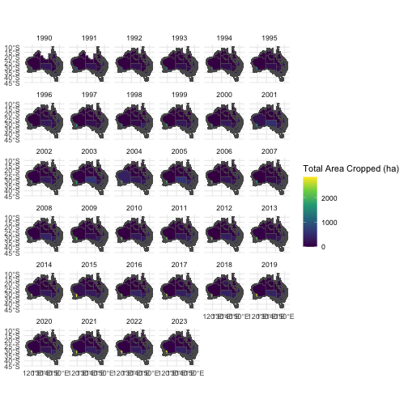

This vignette demonstrates some of the functionality of {read.abares} and how to work with some of the spatial and tabular data available through {read.abares}.
Please note that not all functions are demonstrated here, please refer to the [documentation reference](https://adamhsparks.github.io/read.abares/reference/) for a full list of functionality.
The worked examples here show some of the more advanced features that {read.abares} offers beyond just fetching and importing data, _e.g._, Australian Agricultural and Grazing Industries Survey (AAGIS) spatial shapefile which can be used with tabular data from the historical estimates, the Australian Gridded Farm Data, which can be downloaded and imported using one of four types of object or the soil thickness data, which includes rich metadata.

First we need to load the {read.abares} library.


``` r
library(read.abares)
```

## Working with AAGIS Regions Spatial Data

### Obtaining the AAGIS Regions Spatial Data

ABARES offers spatial data for the Australian Agricultural and Grazing Industries Survey (AAGIS) regions that can be used for mapping tabular data from the estimates, _e.g._, `read_historical_regional_estimates()` or `read_state_estimates()`.


``` r
aagis_regions <- read_aagis_regions()

plot(aagis_regions)
```

<div class="figure" style="text-align: center">

<p class="caption">AAGIS regions shapefile</p>
</div>

### Obtaining AAGIS Data by Region

{read.abares} offers functions to download the ABARES estimates based on the AAGIS results for national level, `read_historical_national_estimates()`, regional level `read_historical_regional_estimates()`, and state level `read_historical_state_estimates()` and also by performance category `read_estimates_by_performance_category()` and size category `read_estimates_by_size()`.
For this example, we will use the `read_historical_regional_estimates()` function to download the AAGIS data for the regions in the AAGIS regions shapefile and join the data and visualise some of the data.


``` r
aagis_region_data <- read_historical_regional_estimates()
```

Filter the AAGIS region data to represent the total area cropped for the year of 2023.
This will make the next few examples execute much more quickly.


``` r
library(dplyr)

aagis_region_data <- filter(aagis_region_data,
                            Variable == "Total area cropped (ha)",
                            Year == 2023)
```

### Merging the AAGIS Regions Spatial Data with the AAGIS Regional Data

Using `read_aagis_regions()` and `read_historical_regional_estimates()`, we can merge the two datasets together to visualise the data.
To join the data, we will use the `left_join()` function from the {dplyr} package.


``` r
aagis_dat <- left_join(aagis_regions, aagis_region_data)
#> Joining with `by = join_by(ABARES_region)`
```

Once we've joined the data, we can visualise it using {ggplot2}.
Here we can plot the total area cropped (ha) for all of Australia for the year 2023.


``` r
library(ggplot2)

ggplot(aagis_dat) +
  geom_sf(aes(fill = Value), colour = NA) +
  scale_fill_viridis_c() +
  labs(
    fill = "Total Area Cropped (ha)"
  ) +
  facet_wrap(~Year) +
  theme_minimal()
```

<div class="figure" style="text-align: center">

<p class="caption">Plot of AAGIS estimated total area cropped by year and region.</p>
</div>

## Working With AGFD Data

You can download files and pipe directly into the class object that you desire for the Australian Farm Gridded Data (AGFD) data.

### Description of the Australian Farm Gridded Data

Directly from the DAFF website:

>The Australian Gridded Farm Data are a set of national scale maps containing simulated data on historical broadacre farm business outcomes including farm profitability on an 0.05-degree (approximately 5 km) grid.

>These data have been produced by read.abares as part of the ongoing Australian Agricultural Drought Indicator (AADI) project (previously known as the Drought Early Warning System Project) and were derived using read.abares farmpredict model, which in turn is based on read.abares Agricultural and Grazing Industries Survey (AAGIS) data.

>These maps provide estimates of farm business profit, revenue, costs and production by location (grid cell) and year for the period 1990-91 to 2022-23. The data do not include actual observed outcomes but rather model predicted outcomes for representative or ‘typical' broadacre farm businesses at each location considering likely farm characteristics and prevailing weather conditions and commodity prices.

>The Australian Gridded Farm Data remain under active development, and as such should be considered experimental.

-- Australian Department of Agriculture, Fisheries and Forestry.

Check the file format information for the NetCDF files.


``` r
print_agfd_nc_file_format()
#> Error in print_agfd_nc_file_format(): could not find function "print_agfd_nc_file_format"
```

Download and read the AGFD files as a list of {stars} objects.


``` r
# A list of {stars} objects for the climate in year 2000
star <- get_agfd(yr = 2000) |>
  read_agfd_stars()
#> Error in get_agfd(yr = 2000): could not find function "get_agfd"

head(star[[1]])
#> Error: object 'star' not found
```

Download and read the AGFD files as a [terra::rast](https://rspatial.github.io/terra/reference/rast.html) object.


``` r
# A {terra} `rast` object
terr <- get_agfd(yr = 2000) |>
  read_agfd_terra()
#> Error in get_agfd(yr = 2000): could not find function "get_agfd"

head(terr[[1]])
#> Error: object 'terr' not found
```

Download and read the AGFD files as a list of {tidync} objects.


``` r
# A list of {tidync} objects
tdnc <- get_agfd(yr = 2000) |>
  read_agfd_tidync()
#> Error in get_agfd(yr = 2000): could not find function "get_agfd"

head(tdnc[[1]])
#> Error: object 'tdnc' not found
```

Download and read the AGFD files as a {data.table} object.


``` r

# A {data.table} object
dtbl <- get_agfd(yr = 2000) |>
  read_agfd_dt()
#> Error in get_agfd(yr = 2000): could not find function "get_agfd"

#Check the completeness and other metadata about the data 
library(skimr)
skim(dtbl)
#> Error: object 'dtbl' not found
```

## Working With the Soil Thickness Map

You can download the soil depth map and import it as a {stars} or [terra::rast()](https://rspatial.github.io/terra/reference/rast.html) object.


``` r
get_topsoil_thickness() |>
  read_topsoil_thickness_stars()
#> Error in get_topsoil_thickness(): could not find function "get_topsoil_thickness"

x <- get_topsoil_thickness() |>
  read_topsoil_thickness_terra()
#> Error in get_topsoil_thickness(): could not find function "get_topsoil_thickness"
```

For your convenience, {read.abares} re-exports [terra::plot()](https://rspatial.github.io/terra/reference/plot.html), so you can just use `plot()` with the {terra} objects in {read.abares}.


``` r
plot(x)
#> Error in h(simpleError(msg, call)): error in evaluating the argument 'x' in selecting a method for function 'plot': object 'x' not found
```

### Soil Thickness Metadata

By default, a brief bit of metadata is printed to the console when you call the topsoil thickness object in your R session.


``` r
get_topsoil_thickness()
#> Error in get_topsoil_thickness(): could not find function "get_topsoil_thickness"
```

But, {read.abares} provides a function for you to browse the topsoil thickness metadata in your console.


``` r
get_topsoil_thickness() |>
  print_topsoil_thickness_metadata()
#> Error in get_topsoil_thickness(): could not find function "get_topsoil_thickness"
```

But you can also access it directly and use [pander::pander()] to include it in a document like this vignette.

<blockquote>

``` r
library(pander)
x <- get_topsoil_thickness()
#> Error in get_topsoil_thickness(): could not find function "get_topsoil_thickness"
y <- x$metadata
#> Error: object 'x' not found
pander(y)
#> Error: object 'y' not found
#> Error in if (tail(stdout, 1) == "") {: argument is of length zero
```
</blockquote>
